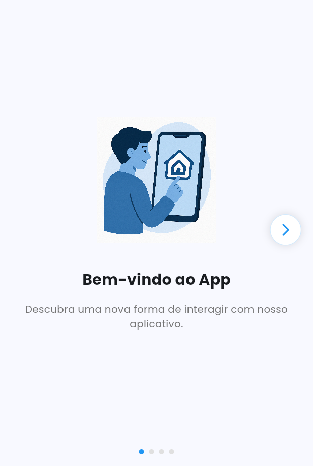
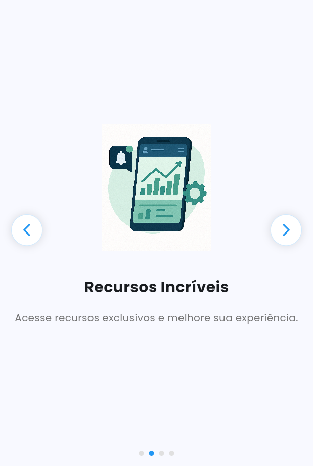
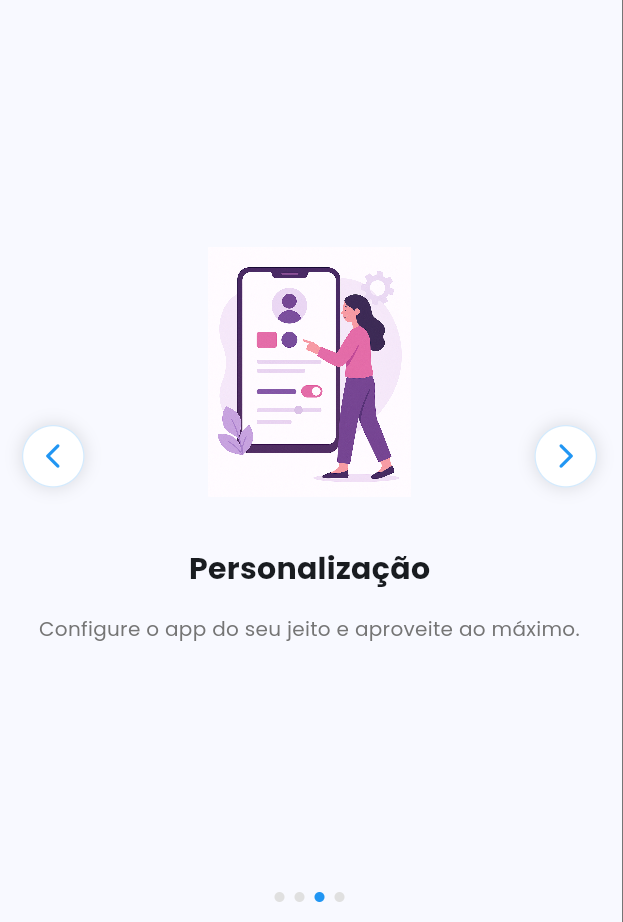
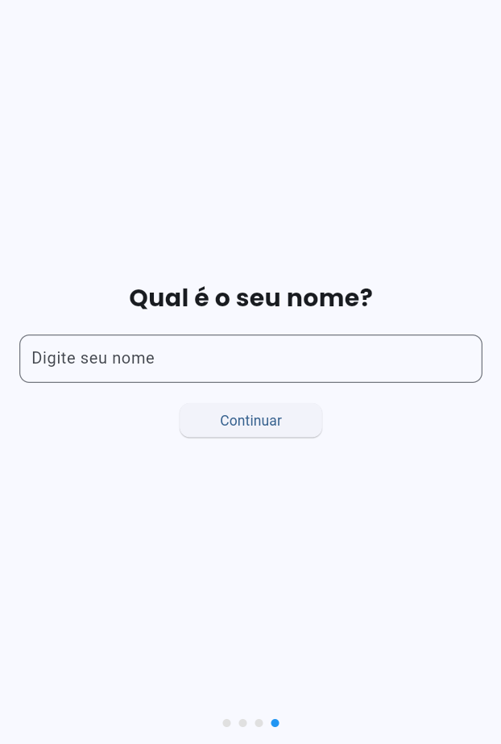
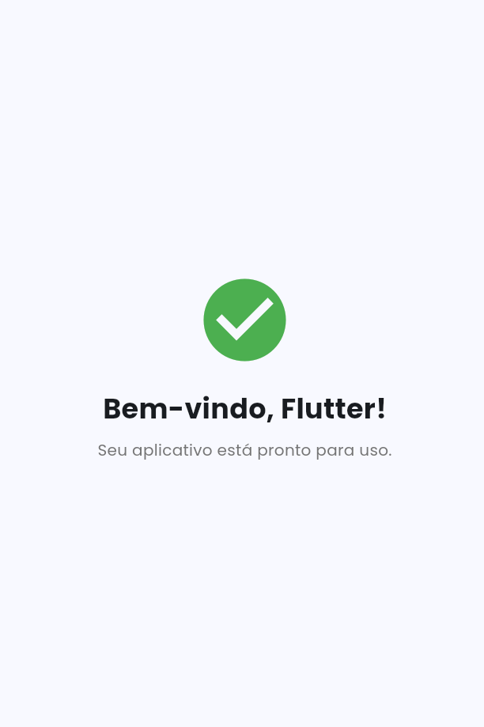
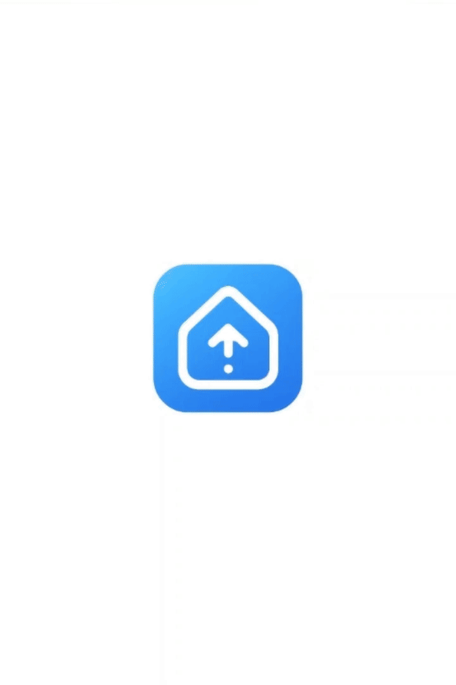

# Splash to Home - App de Boas-vindas

Um aplicativo Flutter que demonstra a implementação de:
- Splash Screen Nativa
- Splash Screen Animada
- Onboarding com 3 telas
- Página de boas-vindas personalizada

## 🚀 Instalação

1. Clone o repositório:
```bash
git clone https://github.com/DiogoCrespi/splash_to_home.git
cd splash_to_home
```

2. Instale as dependências:
```bash
flutter pub get
```

3. Gere a splash screen nativa:
```bash
flutter pub run flutter_native_splash:create
```

4. Execute o app:
```bash
flutter run
```

## 📱 Funcionalidades

### Splash Screen Nativa
- Carregamento instantâneo com logo centralizada
- Configurada via `flutter_native_splash`

### Splash Screen Animada
- Transição suave com fade-in
- Animação de rotação da logo
- Implementada com `AnimatedOpacity` e `AnimationController`

### Onboarding
- 3 telas informativas com:
  - Imagens ilustrativas
  - Títulos e descrições
  - Navegação intuitiva
- Tela final com campo para inserção do nome
- Indicadores de página
- Navegação por gestos ou botões

### Página de Boas-vindas
- Mensagem personalizada com o nome do usuário
- Design moderno e responsivo
- Persistência dos dados do usuário

## 🎨 Fluxo do App

1. **Splash Screen Nativa**
   - Exibição instantânea da logo
   - Transição automática para Splash Animada

2. **Splash Screen Animada**
   - Fade-in da logo
   - Animação de rotação
   - Transição para Onboarding

3. **Onboarding**
   - Navegação entre 3 telas informativas
   - Tela final com campo para nome
   - Persistência dos dados

4. **Página de Boas-vindas**
   - Exibição da mensagem personalizada
   - Interface amigável

## 📦 Dependências

- `flutter_native_splash`: Para splash screen nativa
- `shared_preferences`: Para persistência de dados
- `google_fonts`: Para tipografia personalizada

## 🖼️ Screenshots

<div align="center">
  
  
  
  </div>
<div align="center">
  
  
</div>

## 🎥 Demonstração

<div align="center">
  
</div>

## 👥 Equipe

- Diogo Vinicios Crespi
- Rebeca De Andrade Garcia

## 📝 Licença

Este projeto está sob a licença MIT.
